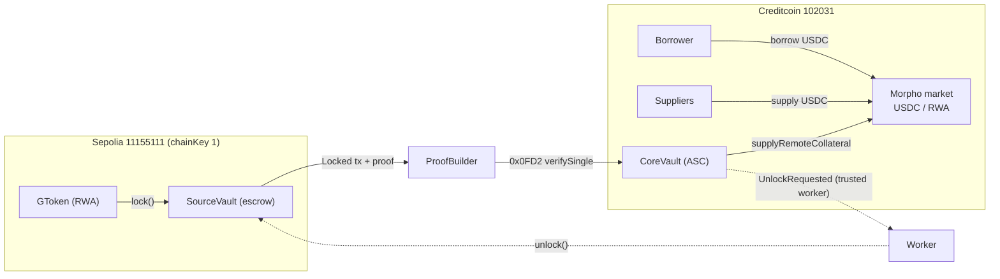

# AttestGO

> We build real compliance infra for humans, not AI slop for judges. 

[](LICENSE)
[](https://docs.attestcoin.org/)
[](https://discord.gg/creditcoin)

Compliance layer for onchain finance — verified identity, compliant RWAs and cross-chain DeFi, with an AI inbox that explains every transaction, leveraging [Attestcoin](https://docs.attestcoin.org/) for trustless cross-chain interoperability.

## Overview

**What is it?** AttestGO connects verified identity (GO Pass), compliant RWA (GO Assets), payments and institutional DeFi through a single verifiable source of truth across chains. One attested pass and one set of rules work everywhere — enforced on every transfer, not bolted on.

**What problem does it solve?** RWA and DeFi today either ignore compliance (unusable for institutions) or re-implement it per chain/app (fragmented, error-prone). Moving collateral cross-chain normally means wrapping/bridging and losing legal enforceability. AttestGO makes eligibility, country controls, travel-rule data and cross-chain state verifiable and self-enforcing.

**How it works.** An [Attestcoin Smart Contract (ASC)](https://docs.attestcoin.org/attestcoin-protocol/attestcoin-readability) on Creditcoin gets **readability** — the ability to trustlessly read and act on state from any source chain — via a decentralized attestor network. AttestGO uses this for identity (GO Pass minted on Sepolia, verified on Creditcoin) and for lending (RWA locked on source chain, position credited on a Creditcoin isolated lending market without the token ever leaving source). AI composes every send into a structured document (IVMS101), hashes for proof and renders a familiar email — inbox, not explorer.

## Key Features

- **GO Pass — reusable KYC identity powered by Sumsub.** Complete KYC through Sumsub once and mint a verified, soulbound identity credential. Verify eligibility across chains with lightweight local checks while minimizing unnecessary identity disclosure.
- **GO Assets — programmable compliance for RWAs.** Create and govern compliant tokenized assets with country-based restrictions, eligibility checks, pause controls, and 1:1 wrapping for existing tokens. Rules are enforced on every transfer and can be updated without redeploying the asset.
- **Compliant payments & cross-chain DeFi.** Every transfer can automatically check identity and asset eligibility, and RWA holders can lock assets on their source chain to borrow on Creditcoin — collateral never leaves source, position credited trustlessly via Attestcoin, letting anyone supply USDC to earn.
- **Documents & Travel Rule, attached to transactions.** Give every transaction its own compliance context with reusable document templates, proofs, and IVMS101 data — without putting sensitive information onchain.
- **AI-composed inbox — compliance humans can understand.** AI turns complex transaction and compliance events into clear, actionable messages — from **KYC failures** and **unsupported jurisdictions** to **payment and asset eligibility** — so users get an explanation instead of an opaque transaction hash.

## Architecture / How it Works

Source chains hold RWA and passes; Creditcoin is the verification hub and lending venue. Attestor network finalizes source blocks → ProofBuilder proves the source tx → Creditcoin `0x0FD2` verifies → contract decodes receipt/events and acts. ETH→CC is permissionless/trustless; CC→ETH settlement is via a trusted worker.


> Detailed flow and trust model below in **Built on Creditcoin + Attestcoin Protocol**. Full lending design: [`contracts/CROSS_CHAIN_LENDING_PLAN.md`](contracts/CROSS_CHAIN_LENDING_PLAN.md).

## Use Cases

- **Issuing compliant RWA tokens.** Issuer calls `GTokenFactory` API, sets country/eligibility rules once, distributes `GToken` — rules enforced on every move, including cross-chain lending collateral.
- **Identity-gated lending.** Lock `GToken` RWA on Sepolia → borrow USDC on Creditcoin Morpho market (`lltv 62%`, `PriceOracle`, `JumpRateIrm`). Collateral never wraps; liquidation credits claims, worker settles real asset.
- **Cross-chain compliant payments with travel-rule.** Send with `GOPass` eligibility + `GToken` rules + auto-generated `IVMS101` payload — verifiable on any chain.
- **Payroll / invoicing with AI documents.** Employer `send` creates hashed invoice + AI email; recipient inbox shows structured salary/invoice with on-chain proof link.
- **Institutional DeFi & custody.** Whitelist jurisdictions per rule, pause markets, wrap existing tokens 1:1 with compliance — without migrating holders.

## Built on Creditcoin + Attestcoin Protocol

The [Attestcoin Protocol](https://docs.attestcoin.org/attestcoin-protocol/attestcoin-readability)
gives an [Attestcoin Smart Contract (ASC)](https://docs.attestcoin.org/attestcoin-protocol/attestcoin-readability) on Creditcoin **readability** — the ability to trustlessly read and act on state from any source chain — in two steps:

1. **Attestation** — a decentralized attestor network tracks finalized source-chain blocks and
   stores consensus attestations on Creditcoin.
2. **Transaction proving** — proofs are generated off-chain (ProofBuilder) and verified
   synchronously on-chain by the **Block Prover Precompile (`0x0FD2`)**. The contract then decodes
   the verified transaction bytes (receipt status + events) and acts on them.

AttestGO uses this in two ways:

- **Identity**: the GO Pass hub mints on Sepolia (chainKey 1); `GOPassRegistry` on Creditcoin
  verifies the mint tx via `verifySingle` and decodes the `PassMinted` log on-chain before
  trusting the record. One pass works everywhere via worker-synced mirrors.
- **Cross-chain lending**: RWA collateral is locked in `SourceVault` on Sepolia; `CoreVault`
  verifies the lock tx via `0x0FD2` and credits the borrower's position on a Morpho-based market
  on Creditcoin — no wrapped token, collateral never leaves the source chain. ETH→CC is
  trustless (permissionless proof submission); CC→ETH (unlock settlement) uses a trusted worker.



Trust model: **ETH → CC trustless** (permissionless proof submission, replay-protected, params
bound to the verified tx on-chain) · **CC → ETH trusted worker** (unlock/seize settlement).
See [`contracts/CROSS_CHAIN_LENDING_PLAN.md`](contracts/CROSS_CHAIN_LENDING_PLAN.md) for the full design.

## Smart contracts

Foundry project in [`contracts/`](contracts). Solc 0.8.19, tested with `forge test` (40 tests).

| Feature | Chain | Contract | Source |
|---|---|---|---|
| GO Pass hub (soulbound KYC NFT, pending→verified 2-phase mint) | Sepolia (chainKey 1) | pending until Creditcoin approves | [`contracts/src/GOPass.sol`](contracts/src/GOPass.sol) |
| Pass verifier — Attestcoin Smart Contract | Creditcoin 102031 | trustless tx-proof sync with on-chain Phase 4 decode | [`contracts/src/GOPassRegistry.sol`](contracts/src/GOPassRegistry.sol) |
| Pass mirror cache for any EVM chain | Base / any EVM | worker-synced, ~5k-gas local eligibility checks | [`contracts/src/GOPassMirror.sol`](contracts/src/GOPassMirror.sol) |
| RWA token with self-enforcing rules | any chain | country bitmap, pause, 1:1 wrapping | [`contracts/src/GToken.sol`](contracts/src/GToken.sol) |
| RWA issuance factory (native + wrapped) | any chain | operator-paid issuance on behalf of issuers | [`contracts/src/GTokenFactory.sol`](contracts/src/GTokenFactory.sol) |
| Lending core (Morpho Blue fork) | Creditcoin | + remote-collateral accounting patch | [`contracts/src/Morpho.sol`](contracts/src/Morpho.sol) |
| RWA collateral escrow (lock/unlock, FIFO) | Sepolia | proof payload emitter | [`contracts/src/SourceVault.sol`](contracts/src/SourceVault.sol) |
| ASC verifier + lending facade + liquidation claims | Creditcoin | 0x0FD2 + RLP Phase 4 decode | [`contracts/src/CoreVault.sol`](contracts/src/CoreVault.sol) |
| ISO-2 country bitmap library | any chain | whitelist/blacklist per Rule | [`contracts/src/libraries/CountryBitmap.sol`](contracts/src/libraries/CountryBitmap.sol) |

## Workers & scripts

Scripts are plain TypeScript (`npx tsx`) using `ethers` v6 and `@gluwa/usc-sdk` for proof
generation. Every cross-chain flow has exactly one trust boundary: the CC→ETH worker.

| Script | Role | Trust |
|---|---|---|
| [`scripts/gopass/2_mint.ts`](scripts/gopass/2_mint.ts) | Mint pending GO Pass on the hub | — |
| [`scripts/gopass/3_worker_sync.ts`](scripts/gopass/3_worker_sync.ts) | Oracle Query Worker: proof gen + `syncPassWithTxProof` on Creditcoin | trustless submission |
| [`scripts/gopass/7_sync_mirror.ts`](scripts/gopass/7_sync_mirror.ts) | Sync verified record to mirrors on new chains | trusted worker |
| [`scripts/lending/1_lend_setup.ts`](scripts/lending/1_lend_setup.ts) | Market wiring + first USDC supply | — |
| [`scripts/lending/2_lend_e2e.ts`](scripts/lending/2_lend_e2e.ts) | Borrower E2E: lock → prove → credit → borrow → repay → requestUnlock | trustless submission |
| [`scripts/lending/3_worker_unlock.ts`](scripts/lending/3_worker_unlock.ts) | Settle `UnlockRequested` on Sepolia (borrower exits + liquidator payouts) | trusted worker |
| [`scripts/cross-chain-bridge/`](scripts/cross-chain-bridge/) | Payment-stream bridge demos + workers (previous iterations) | mixed |

## Getting Started

### Prerequisites

- Node 20+, `npm`, Foundry (`forge` 0.8.19), `npx tsx`
- RPC URLs: `SEPOLIA_RPC_URL`, `CREDITCOIN_RPC_URL`, `PROOF_BUILDER_URL`

### Installation

```shell
npm install
cd contracts && forge build
```

### Quick start

Web app (Next.js App Router + AWS Amplify):

```shell
npm run dev
# http://localhost:3000
```

Contracts:

```shell
cd contracts
forge test
```

Deploy — GO Pass hub on Sepolia, registry on Creditcoin:

```shell
forge script contracts/script/1_DeployGOPass.s.sol --rpc-url $SEPOLIA_RPC_URL --broadcast --legacy
GOPASS_ADDR=0x... forge script contracts/script/2_DeployGOPassRegistry.s.sol --rpc-url $CREDITCOIN_RPC_URL --broadcast --legacy
```

Deploy — cross-chain lending (see [deploy plan](contracts/CROSS_CHAIN_LENDING_PLAN.md)):

```shell
# Sepolia: collateral escrow
LENDING_SIDE=source forge script contracts/script/5_DeployLending.s.sol --rpc-url $SEPOLIA_RPC_URL --broadcast --legacy
# Creditcoin: Morpho + CoreVault + market
LENDING_SIDE=credit USDC_CC=0x.. GTOKEN_CC=0x.. GTOKEN_SOURCE=0x.. ORACLE_ADDR=0x.. SOURCE_VAULT_ADDR=0x.. \
  forge script contracts/script/5_DeployLending.s.sol --rpc-url $CREDITCOIN_RPC_URL --broadcast --legacy
```

### Environment variables

`PRIVATE_KEY`, `SEPOLIA_RPC_URL`, `CREDITCOIN_RPC_URL`, `PROOF_BUILDER_URL`, plus per-flow addresses (`GOPASS_ADDR`, `REGISTRY_ADDR`, `CORE_VAULT_ADDR`, `SOURCE_VAULT_ADDR`, …). See [`scripts/.env.example`](scripts/.env.example) and each script header.

## API / SDK Reference

Short overview — full REST ledger in the app:

- `POST /tokens` — issue compliant `GToken` (native/wrapped), operator pays gas — [`app/docs`](app/docs)
- `GET /tokens?issuer=` — list by issuer
- Issuer/market/announcement APIs for RWA — see docs panel.

SDK: `ethers` v6 + `@gluwa/usc-sdk` for `0x0FD2` proofs; `amplify/data` for app backend.

## Project Structure

```
app/                  Next.js App Router (landing, identity app, AI inbox)
components/           Landing + app UI (Hero, Sidebar, Discover, DocsNav)
amplify/              AWS Amplify Gen2 backend (auth, data, functions)
contracts/            Foundry: smart contracts + tests + deploy scripts
scripts/              Operational TypeScript: gopass / lending / cross-chain-bridge
```

## Development

```shell
npm run dev          # app
cd contracts
forge build
forge test -v        # ~40 tests including morpho + vaults
```

Contributing: see [CONTRIBUTING.md](CONTRIBUTING.md). Security disclosures: [CONTRIBUTING.md#security-issue-notifications](CONTRIBUTING.md#security-issue-notifications).

## Roadmap

- **Now:** GO Pass (Sepolia→CC→mirrors), GToken factory, SourceVault/CoreVault + Morpho remote collateral, AI inbox.
- **Next:** Per-market KYC gating (`GOPassMirror.isEligible` in `borrow`), PriceOracle staleness fix, unlock timelock for RWA T+ settlement.
- **Later:** Mainnet source chains, multi-worker quorum, adaptive IRM, payroll/invoicing templates.

## Links

- Website: [attestgo.com](https://attestgo.com) · Docs: [docs.attestcoin.org](https://docs.attestcoin.org/) · Attestcoin readability: [attestcoin-readability](https://docs.attestcoin.org/attestcoin-protocol/attestcoin-readability)
- Demo: `/app` (Inbox / Discover / Identity / Send / Earn)
- Discord / Twitter: add links here

## Deploying to AWS

For detailed instructions on deploying the web application, refer to the
[Amplify deployment docs](https://docs.amplify.aws/nextjs/start/quickstart/nextjs-app-router-client-components/#deploy-a-fullstack-app-to-aws).

## Security

See [CONTRIBUTING](CONTRIBUTING.md#security-issue-notifications) for more information.

## License

This library is licensed under the MIT-0 License. See the LICENSE file.
