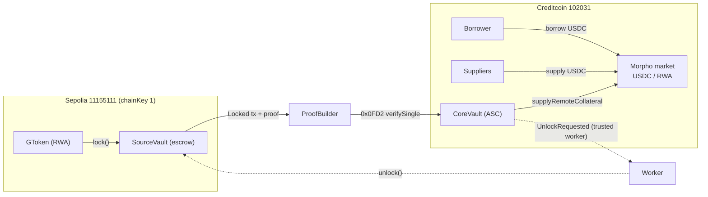

# AttestGO

**AI Makes Compliance Simple for Onchain Finance** — `IDENTITY × RWA × COMPLIANCE`

AttestGO connects verified identity, compliant assets, payments and DeFi, using the
[Attestcoin Protocol](https://docs.attestcoin.org/) to keep a single, verifiable source of truth
across chains — with AI turning every action into a human-readable inbox.

## What you can build

**One GO Pass, Every Chain** — Mint a universal pass once and reuse it across apps and compliant
payment flows. Attested on Creditcoin via an Attestcoin Smart Contract, verifiable on any chain.
Privacy-preserving verification with minimal data exposure. KYC by Sumsub from day one.

**GO Assets: RWA + Self-Enforcing Rules** — Issuers get the API to create, govern and distribute
digital representations of real-world value with identity-aware controls. Define eligibility once,
enforced on every move. Whitelist or blacklist countries without redeploying. Wrap any existing
token 1:1 with compliance added. Pause or update rules without touching holders.

**Institutional-Ready DeFi** — One interface for payments and DeFi with RWA, checked via GO Pass
and GO Asset rules on every transfer. Lend and borrow on Creditcoin while collateral stays locked
on its source chain. Travel-rule data generated for every transfer.

**AI Composed Inbox** — Salary, invoice, receipt: every send creates a structured document, hashed
for proof, then rendered by AI into a human email. Recipients see a familiar inbox, not raw hashes
or explorer links. IVMS101 data standard, <400ms proof attach, hash-only on-chain footprint.

## Built on Creditcoin + Attestcoin Protocol

The [Attestcoin Protocol](https://docs.attestcoin.org/attestcoin-protocol/attestcoin-readability)
gives Creditcoin contracts **readability**: the ability to trustlessly read state from any source
chain in two steps:

1. **Attestation** — a decentralized attestor network tracks finalized source-chain blocks and
   stores consensus attestations on Creditcoin.
2. **Transaction proving** — proofs are generated off-chain (ProofBuilder) and verified
   synchronously on-chain by the **Block Prover Precompile (`0x0FD2`)**. The contract then decodes
   the verified transaction bytes (receipt status + events) and acts on them.

AttestGO uses this in two ways:

- **Identity**: the GO Pass hub mints on Sepolia (chainKey 1); `GOPassRegistry` on Creditcoin
  verifies the mint tx via `verifySingle` and decodes the `PassMinted` log on-chain before
  trusting the record. One pass works everywhere via worker-synced mirrors.
- **Cross-chain lending**: RWA collateral is locked in `SourceVault` on Sepolia; `CoreVault`
  verifies the lock tx via `0x0FD2` and credits the borrower's position on a Morpho-based market
  on Creditcoin — no wrapped token, collateral never leaves the source chain. ETH→CC is
  trustless (permissionless proof submission); CC→ETH (unlock settlement) uses a trusted worker.



Trust model: **ETH → CC trustless** (permissionless proof submission, replay-protected, params
bound to the verified tx on-chain) · **CC → ETH trusted worker** (unlock/seize settlement).
See [`contracts/CROSS_CHAIN_LENDING_PLAN.md`](contracts/CROSS_CHAIN_LENDING_PLAN.md) for the full design.

## Smart contracts

Foundry project in [`contracts/`](contracts). Solc 0.8.19, tested with `forge test` (40 tests).

| Feature | Chain | Contract | Source |
|---|---|---|---|
| GO Pass hub (soulbound KYC NFT, pending→verified 2-phase mint) | Sepolia (chainKey 1) | pending until Creditcoin approves | [`contracts/src/GOPass.sol`](contracts/src/GOPass.sol) |
| Pass verifier — Attestcoin Smart Contract | Creditcoin 102031 | trustless tx-proof sync with on-chain Phase 4 decode | [`contracts/src/GOPassRegistry.sol`](contracts/src/GOPassRegistry.sol) |
| Pass mirror cache for any EVM chain | Base / any EVM | worker-synced, ~5k-gas local eligibility checks | [`contracts/src/GOPassMirror.sol`](contracts/src/GOPassMirror.sol) |
| RWA token with self-enforcing rules | any chain | country bitmap, pause, 1:1 wrapping | [`contracts/src/GToken.sol`](contracts/src/GToken.sol) |
| RWA issuance factory (native + wrapped) | any chain | operator-paid issuance on behalf of issuers | [`contracts/src/GTokenFactory.sol`](contracts/src/GTokenFactory.sol) |
| Lending core (Morpho Blue fork) | Creditcoin | + remote-collateral accounting patch | [`contracts/src/Morpho.sol`](contracts/src/Morpho.sol) |
| RWA collateral escrow (lock/unlock, FIFO) | Sepolia | proof payload emitter | [`contracts/src/SourceVault.sol`](contracts/src/SourceVault.sol) |
| ASC verifier + lending facade + liquidation claims | Creditcoin | 0x0FD2 + RLP Phase 4 decode | [`contracts/src/CoreVault.sol`](contracts/src/CoreVault.sol) |
| ISO-2 country bitmap library | any chain | whitelist/blacklist per Rule | [`contracts/src/libraries/CountryBitmap.sol`](contracts/src/libraries/CountryBitmap.sol) |

## Workers & scripts

Scripts are plain TypeScript (`npx tsx`) using `ethers` v6 and `@gluwa/usc-sdk` for proof
generation. Every cross-chain flow has exactly one trust boundary: the CC→ETH worker.

| Script | Role | Trust |
|---|---|---|
| [`scripts/gopass/2_mint.ts`](scripts/gopass/2_mint.ts) | Mint pending GO Pass on the hub | — |
| [`scripts/gopass/3_worker_sync.ts`](scripts/gopass/3_worker_sync.ts) | Oracle Query Worker: proof gen + `syncPassWithTxProof` on Creditcoin | trustless submission |
| [`scripts/gopass/7_sync_mirror.ts`](scripts/gopass/7_sync_mirror.ts) | Sync verified record to mirrors on new chains | trusted worker |
| [`scripts/lending/1_lend_setup.ts`](scripts/lending/1_lend_setup.ts) | Market wiring + first USDC supply | — |
| [`scripts/lending/2_lend_e2e.ts`](scripts/lending/2_lend_e2e.ts) | Borrower E2E: lock → prove → credit → borrow → repay → requestUnlock | trustless submission |
| [`scripts/lending/3_worker_unlock.ts`](scripts/lending/3_worker_unlock.ts) | Settle `UnlockRequested` on Sepolia (borrower exits + liquidator payouts) | trusted worker |
| [`scripts/cross-chain-bridge/`](scripts/cross-chain-bridge/) | Payment-stream bridge demos + workers (previous iterations) | mixed |

## Quickstart

Web app (Next.js App Router + AWS Amplify):

```shell
npm install
npm run dev
```

Contracts (Foundry):

```shell
cd contracts
forge build
forge test
```

Deploy — GO Pass hub on Sepolia, registry on Creditcoin:

```shell
forge script contracts/script/1_DeployGOPass.s.sol --rpc-url $SEPOLIA_RPC_URL --broadcast --legacy
GOPASS_ADDR=0x... forge script contracts/script/2_DeployGOPassRegistry.s.sol --rpc-url $CREDITCOIN_RPC_URL --broadcast --legacy
```

Deploy — cross-chain lending (see [deploy plan](contracts/CROSS_CHAIN_LENDING_PLAN.md)):

```shell
# Sepolia: collateral escrow
LENDING_SIDE=source forge script contracts/script/5_DeployLending.s.sol --rpc-url $SEPOLIA_RPC_URL --broadcast --legacy
# Creditcoin: Morpho + CoreVault + market
LENDING_SIDE=credit USDC_CC=0x.. GTOKEN_CC=0x.. GTOKEN_SOURCE=0x.. ORACLE_ADDR=0x.. SOURCE_VAULT_ADDR=0x.. \
  forge script contracts/script/5_DeployLending.s.sol --rpc-url $CREDITCOIN_RPC_URL --broadcast --legacy
```

Key env vars: `PRIVATE_KEY`, `SEPOLIA_RPC_URL`, `CREDITCOIN_RPC_URL`, `PROOF_BUILDER_URL`,
contract addresses per flow (`GOPASS_ADDR`, `REGISTRY_ADDR`, `CORE_VAULT_ADDR`, `SOURCE_VAULT_ADDR`, ...).
See [`scripts/.env.example`](scripts/.env.example) and the script headers for the full list.

## Repository layout

```
app/                  Next.js App Router (landing page, identity app, AI inbox)
components/           Landing page + app UI
amplify/              AWS Amplify Gen2 backend (auth, data, functions)
contracts/            Foundry: smart contracts + tests + deploy scripts
scripts/              Operational TypeScript: gopass / lending / cross-chain-bridge
```

## Deploying to AWS

For detailed instructions on deploying the web application, refer to the
[Amplify deployment docs](https://docs.amplify.aws/nextjs/start/quickstart/nextjs-app-router-client-components/#deploy-a-fullstack-app-to-aws).

## Security

See [CONTRIBUTING](CONTRIBUTING.md#security-issue-notifications) for more information.

## License

This library is licensed under the MIT-0 License. See the LICENSE file.
