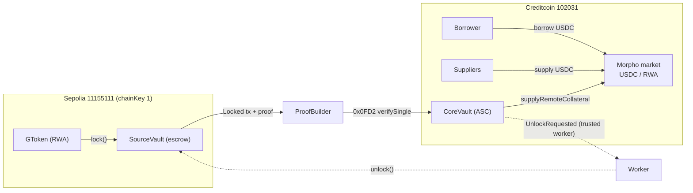

# AttestGO

> Onchain Finance, Delivered to Your Inbox

[](LICENSE)
[](https://docs.attestcoin.org/)
[](https://x.com/tamago_labs_JP)

We build compliance infrastructure for onchain finance — verified identity, compliant RWAs, and cross-chain DeFi, with an AI inbox that explains every transaction, leveraging [Attestcoin](https://docs.attestcoin.org/) for trustless cross-chain interoperability.

## Overview

**What is it?** AttestGO connects verified identity (GO Pass), compliant RWA (GO Assets), payments and institutional DeFi through a single verifiable source of truth across chains. One attested pass and one set of rules work everywhere — enforced on every transfer, not bolted on.

**What problem does it solve?** RWA and DeFi today either ignore compliance (unusable for institutions) or re-implement it per chain/app (fragmented, error-prone). Moving collateral cross-chain normally means wrapping/bridging and losing legal enforceability. AttestGO makes eligibility, country controls, travel-rule data and cross-chain state verifiable and self-enforcing.

**How it works.** An [Attestcoin Smart Contract (ASC)](https://docs.attestcoin.org/attestcoin-protocol/attestcoin-readability) on Creditcoin gets **readability** — the ability to trustlessly read and act on state from any source chain — via a decentralized attestor network. AttestGO uses this for identity (GO Pass minted on Sepolia, verified on Creditcoin) and for lending (RWA locked on source chain, position credited on a Creditcoin isolated lending market without the token ever leaving source). AI turns every on-chain event into a human-readable inbox message — compliance status, transfer receipts, Travel Rule data — so users get clarity, not opaque hashes.

## Key Features

- **GO Pass — reusable KYC identity powered by Sumsub.** Complete KYC through Sumsub once and mint a verified, soulbound identity credential. Verify eligibility across chains with lightweight local checks while minimizing unnecessary identity disclosure.
- **GO Assets — programmable compliance for RWAs.** Create and govern compliant tokenized assets with country-based restrictions, eligibility checks, pause controls, and 1:1 wrapping for existing tokens. Rules are enforced on every transfer and can be updated without redeploying the asset.
- **Compliant payments & cross-chain DeFi.** Every transfer can automatically check identity and asset eligibility, and RWA holders can lock assets on their source chain to borrow on Creditcoin — collateral never leaves source, position credited trustlessly via Attestcoin, letting anyone supply USDC to earn.
- **Documents & Travel Rule, attached to every transfer.** Prepare Travel Rule data by default — originator auto-filled from GO Pass, beneficiary info resolved when needed, and AI-generated supporting documents (invoices, agreements, source-of-funds) — all with zero-threshold compliance and hash-only onchain footprint.
- **AI-composed inbox — compliance humans can understand.** AI turns complex transaction and compliance events into clear, actionable messages — from **KYC failures** and **unsupported jurisdictions** to **payment and asset eligibility** — so users get an explanation instead of an opaque transaction hash.

## Use Cases

- **Issue compliant RWAs.** Set eligibility rules once (country, tier), distribute tokens — rules enforced on every transfer and cross-chain lending position.
- **Borrow against RWA collateral.** Lock tokens on source chain → borrow USDC on Creditcoin. Collateral never wraps, never bridges — position credited trustlessly via Attestcoin.
- **Send compliant payments.** Every transfer auto-attaches Travel Rule data from GO Pass, resolves beneficiary info, and generates supporting documents — zero-threshold compliance out of the box.
- **Get paid with AI documents.** Receive salary or invoice payments with AI-generated documents and a clear inbox explanation — no opaque transaction hashes.
- **Institutions & custody.** Whitelist jurisdictions, pause markets, wrap existing tokens 1:1 with compliance rules — without migrating holders.

## Architecture

AttestGO connects source chains (where RWAs and passes live) with Creditcoin (the verification hub and lending venue). The app drives both flows end to end: suppliers earn yield on Creditcoin, borrowers lock RWA on source chain and borrow trustlessly.

AttestGO is built on AWS Amplify Gen2 — a fullstack TypeScript framework that provides data (AppSync/DynamoDB), storage (S3), serverless functions (Lambda), and API Gateway. The Amplify backend powers identity, token registry, attestation orchestration, and cross-chain proof submission. AI features (inbox composition, document generation) are powered by AWS Bedrock with managed Anthropic models, alongside:

- **Frontend** — Next.js app (Discover, Send, Earn, Borrow, Inbox) with embedded wallet.
- **Smart Contracts** — GToken, Lending, Vault, Oracle on source chain and Creditcoin.
- **Workers** — Attestation relayers, announcement registry, price oracles.
- **Protocol** — Attestcoin for cross-chain proofs and settlement.


> Full lending design: [`contracts/CROSS_CHAIN_LENDING_PLAN.md`](contracts/CROSS_CHAIN_LENDING_PLAN.md).

## Built on Attestcoin Protocol

The [Attestcoin Protocol](https://docs.attestcoin.org/attestcoin-protocol/attestcoin-readability)
gives an [Attestcoin Smart Contract (ASC)](https://docs.attestcoin.org/attestcoin-protocol/attestcoin-readability) on Creditcoin **readability** — the ability to trustlessly read and act on state from any source chain — in two steps:

1. **Attestation** — a decentralized attestor network tracks finalized source-chain blocks and
   stores consensus attestations on Creditcoin.
2. **Transaction proving** — proofs are generated off-chain (ProofBuilder) and verified
   synchronously on-chain by the **Block Prover Precompile (`0x0FD2`)**. The contract then extracts
   the expected event log from the verified bytes (ABI-encoded transaction + receipt) and acts on it.

AttestGO uses this in two ways:

- **Identity**: the GO Pass hub mints on Sepolia (chainKey 1); `GOPassRegistry` on Creditcoin
  verifies the mint tx via `verifySingle` and decodes the `PassMinted` log on-chain before
  trusting the record. One pass works everywhere via worker-synced mirrors.
- **Cross-chain lending**: RWA collateral is locked in `SourceVault` on Sepolia; `CoreVault`
  verifies the lock tx via `0x0FD2` and credits the borrower's position on a Morpho-based market
  on Creditcoin — no wrapped token, collateral never leaves the source chain. ETH→CC is
  trustless (permissionless proof submission); CC→ETH (unlock settlement) uses a trusted worker.



Trust model: **ETH → CC trustless** (permissionless proof submission, replay-protected, params
bound to the verified tx on-chain) · **CC → ETH trusted worker** (unlock/seize settlement).
See [`contracts/CROSS_CHAIN_LENDING_PLAN.md`](contracts/CROSS_CHAIN_LENDING_PLAN.md) for the full design.

## Getting Started

### Prerequisites

- Node 20+, `npm`, Foundry (`forge` 0.8.19), `npx tsx`
- RPC URLs: `SEPOLIA_RPC_URL`, `CREDITCOIN_RPC_URL`, `PROOF_BUILDER_URL`

### Installation

```shell
npm install
cd contracts && forge build
```

### Quick start

Web app (Next.js App Router + AWS Amplify):

```shell
npm run dev
# http://localhost:3000
```

Contracts:

```shell
cd contracts
forge test
```

Deploy — GO Pass hub on Sepolia, registry on Creditcoin:

```shell
forge script contracts/script/1_DeployGOPass.s.sol --rpc-url $SEPOLIA_RPC_URL --broadcast --legacy
GOPASS_ADDR=0x... forge script contracts/script/2_DeployGOPassRegistry.s.sol --rpc-url $CREDITCOIN_RPC_URL --broadcast --legacy
```

Deploy — cross-chain lending (see [deploy plan](contracts/CROSS_CHAIN_LENDING_PLAN.md)); each script
deploys only its own contract, reuses anything already deployed via its `*_ADDR` env, and the
CoreVault script validates oracle/IRM/Morpho before spending gas:

```shell
# Creditcoin: lending primitives
forge script contracts/script/5_DeployMorpho.s.sol --rpc-url $CREDITCOIN_RPC_URL --broadcast --legacy
COLLATERAL_USD=1000000000000000000 LOAN_USD=1000000000000000000 LOAN_TOKEN=0x.. COLLATERAL_TOKEN=0x.. \
  forge script contracts/script/6_DeployOracle.s.sol --rpc-url $CREDITCOIN_RPC_URL --broadcast --legacy
forge script contracts/script/7_DeployIrm.s.sol --rpc-url $CREDITCOIN_RPC_URL --broadcast --legacy
# Sepolia: collateral escrow
forge script contracts/script/8_DeploySourceVault.s.sol --rpc-url $SEPOLIA_RPC_URL --broadcast --legacy
# Creditcoin: deploy-only (no wiring — 1_lend_setup.ts validates and wires)
MORPHO_ADDR=0x.. SOURCE_VAULT_ADDR=0x.. forge script contracts/script/9_DeployCoreVault.s.sol --rpc-url $CREDITCOIN_RPC_URL --broadcast --legacy
# Wire everything: worker, mappings, both markets, lltv/irm enable (plain TS)
npx tsx scripts/lending/1_lend_setup.ts --all
# Optional: NAV primary markets + mint test GTokens (Sepolia)
forge script contracts/script/10_DeployPrimaryMarket.s.sol --rpc-url $SEPOLIA_RPC_URL --broadcast --legacy
forge script contracts/script/4_MintGToken.s.sol --rpc-url $SEPOLIA_RPC_URL --broadcast --legacy
```

### Environment variables

`PRIVATE_KEY`, `SEPOLIA_RPC_URL`, `CREDITCOIN_RPC_URL`, `PROOF_BUILDER_URL`, plus per-flow addresses (`GOPASS_ADDR`, `REGISTRY_ADDR`, `CORE_VAULT_ADDR`, `SOURCE_VAULT_ADDR`, …). See [`scripts/.env.example`](scripts/.env.example) and each script header.

## Deployment

### Creditcoin Testnet (102031)

| Contract | Address |
|---|---|
| GOPassRegistry | [`0x6354C594...BD09E`](https://creditcoin-testnet.blockscout.com/address/0x6354C59497Ba87F1c05b5B56C7c45283187BD09E) |
| Morpho | [`0x10FbF147...E67D`](https://creditcoin-testnet.blockscout.com/address/0x10FbF147BfaC591c1756C67b1eAfeaEB11b3E67D) |
| Mock ATC | [`0x3f0e699A...9DA6a`](https://creditcoin-testnet.blockscout.com/address/0x3f0e699Ad6F14324c93A23Cd57aef60Ffa09DA6a) |
| Mock CUSDT | [`0x60f6456F...5F8E`](https://creditcoin-testnet.blockscout.com/address/0x60f6456FBE5566e515E63219fC9c0dbb80015F8E) |
| Oracle CUSDT/aN225 | [`0x4865dc0C...bB082`](https://creditcoin-testnet.blockscout.com/address/0x4865dc0C4A3B11CF6FB57Dec180577f4824bB082) |
| Oracle ATC/aTBILL | [`0xC78D2b54...793cd`](https://creditcoin-testnet.blockscout.com/address/0xC78D2b542Ef075c0753332ab2aA63b8C3f3793cd) |
| JumpRateIrm | [`0x3345A658...18DBb`](https://creditcoin-testnet.blockscout.com/address/0x3345A6582669C00cA022d9200C083b3097B18DBb) |
| CoreVault | [`0x51062701...24434`](https://creditcoin-testnet.blockscout.com/address/0x51062701163469d30a0c4331BB2FBab215d24434) |

| Market | ID |
|---|---|
| Nikkei (CUSDT/aN225) | `0x9608d88cb246f72f3de52c1575ce7cd5b386e12315a3cee982fcf111089616f5` |
| TBill (ATC/aTBILL) | `0x4666d84f3848272a29911731b190897fd3f6d783d052141929a925960f73ae2f` |

### ETH Sepolia (11155111)

| Contract | Address |
|---|---|
| GTokenFactory | [`0x7843c062...4A820`](https://sepolia.etherscan.io/address/0x7843c062939FCBfA150c962a4214d2e14714A820) |
| GOPass | [`0x0a6aD3b8...33334`](https://sepolia.etherscan.io/address/0x0a6aD3b8B8D1A69Ba44002983e64e4824cB63334) |
| Mock JPYC | [`0xB8712751...E5D0`](https://sepolia.etherscan.io/address/0xB8712751fFBe66DA15f2aCCCf0DFE8071Cc2E5D0) |
| Mock USDT | [`0x8d1A804D...137B`](https://sepolia.etherscan.io/address/0x8d1A804D73CA595A8538C805Daef6FE8Ec68137B) |
| GToken aN225 | [`0xc55D7821...B5a8`](https://sepolia.etherscan.io/address/0xc55D7821b6e0D8AC162e5b672aa9eA87A066B5a8) |
| GToken aTBILL | [`0x266F1BA9...83Db`](https://sepolia.etherscan.io/address/0x266F1BA9Cd984D8DC9cb7029A7c69e9d216283Db) |
| PrimaryMarket Nikkei | [`0xd19d9403...B73D`](https://sepolia.etherscan.io/address/0xd19d94035CA56B02c889396975FA12Fb6f72B73D) |
| PrimaryMarket TBill | [`0x7eE76595...508B`](https://sepolia.etherscan.io/address/0x7eE76595B70991cE74812b4B352fb032B11B508B) |
| SourceVault | [`0xd81F1A1a...F6ED`](https://sepolia.etherscan.io/address/0xd81F1A1a63fB33989bF46432527A6F7E997cF6ED) |

## Workers & scripts

Scripts are plain TypeScript (`npx tsx`) using `ethers` v6 and `@gluwa/usc-sdk` for proof
generation. The web app performs the same submissions through Amplify lambdas (`attestPass`,
`attestLock`) — sponsored, but still permissionless submitters. Every cross-chain flow has exactly
one trust boundary: the CC→ETH worker.

| Script | Role | Trust |
|---|---|---|
| [`scripts/gopass/2_mint.ts`](scripts/gopass/2_mint.ts) | Mint pending GO Pass on the hub | — |
| [`scripts/gopass/3_worker_sync.ts`](scripts/gopass/3_worker_sync.ts) | Oracle Query Worker: proof gen + `syncPassWithTxProof` on Creditcoin | trustless submission |
| [`scripts/gopass/7_sync_mirror.ts`](scripts/gopass/7_sync_mirror.ts) | Sync verified record to mirrors on new chains | trusted worker |
| [`scripts/lending/1_lend_setup.ts`](scripts/lending/1_lend_setup.ts) | Wire everything (`--all`): worker, oracle↔IRM↔lltv enable, token mappings, create both markets | — |
| [`scripts/lending/2a_supply_liquidity.ts`](scripts/lending/2a_supply_liquidity.ts) | Supplier: approve + supply loan tokens into a market | — |
| [`scripts/lending/2b_lock_collateral.ts`](scripts/lending/2b_lock_collateral.ts) | Borrower: lock RWA on Sepolia (records lockId) | — |
| [`scripts/lending/2c_prove_and_borrow.ts`](scripts/lending/2c_prove_and_borrow.ts) | Submit proof (SDK `txBytes` verbatim) → collateral credited → borrow (`--borrow-only` skips proof) | trustless submission |
| [`scripts/lending/2d_repay_and_unlock.ts`](scripts/lending/2d_repay_and_unlock.ts) | Repay + `requestUnlock` (worker settles on Sepolia) | — |
| [`scripts/lending/probe_proof.ts`](scripts/lending/probe_proof.ts) / [`probe2_txbytes.ts`](scripts/lending/probe2_txbytes.ts) | Proof-format diagnostics (Attestcoin precompile ABI-blob format) | — |
| [`scripts/lending/3_worker_unlock.ts`](scripts/lending/3_worker_unlock.ts) | Settle `UnlockRequested` on Sepolia (borrower exits + liquidator payouts) | trusted worker |
| [`scripts/cross-chain-bridge/`](scripts/cross-chain-bridge/) | Payment-stream bridge demos + workers (previous iterations) | mixed |

## Deploying to AWS

For detailed instructions on deploying the web application, refer to the
[Amplify deployment docs](https://docs.amplify.aws/nextjs/start/quickstart/nextjs-app-router-client-components/#deploy-a-fullstack-app-to-aws).

## Security

See [CONTRIBUTING](CONTRIBUTING.md#security-issue-notifications) for more information.

## License

This project is licensed under the Apache License 2.0. See the LICENSE file.
